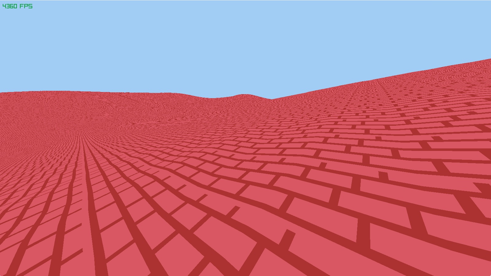

# Terrain Generator in Zig 

This terrain generator uses multiple optimizations to achieve better performance generating and rendering big terrain meshes.
Inspiration came from the rendering optimization series in this channel: https://www.youtube.com/@Vercidium.

Raylib is being used mostly to create a window, and get keyboard input. Raw OpenGL had to be used for better optimization with the shared VBO/EBO/UBO for the mesh batch rendering.
The noise library is a WIP hosted in another repository in my github profile https://github.com/lulvz/simple-noises.

## CPU -> GPU data optimization
For every vertex, only a single unsigned 32 bit integer is being sent to the GPU, containg data about it's **height**, **texture ID** and **normal** encoded as Pitch/Yaw.

```zig
const chunkVertexInformation = packed struct(u32) {
    height: u8,
    texture_id: u12, // total of 4096 textures in a 2048x2048 texture atlas (each texture is 32x32 pixels)
    normal_pitch: u6,
    normal_yaw: u6,
};
```
Zig's packed structs are amazing!

About location data, only the height is being sent, because every chunk is essentially a grid, and the x/z positions of every vertex are known simply by the order at which it is being passed to the vertex shader, so we can leverage the gl_VertexID variable to get these values, see [terrain_indices_batch.vs](resources/terrain_indices_batch.vs)

In the spirit of minimizing the size of each vertex's information, I ended up with only a byte of information to specify the height of each vertex (256 values), which turned out to be a bit restricting. Either the height had to be capped at a lower value like 32 units (current implementation) to allow for more smooth height jumps **(32.0/255.0)** or smoothness had to be sacrificed to allow for more max height.

At some point in the development of the terrain generator, a triangle strip was used to make the mesh, which would reduce the amount of vertices by a considerable amount, however, most recent GPUs are optimized for triangle rendering using indices anyway. With the triangle strip I also couldn't map the UV coordinates correctly to use a texture atlas for tiling, since there weren't enough vertices, and each vertex can only have one set of UV coordinates.

## Usage

Simply do `zig build run`, and dependencies should be fetched automatically and the app should run.

Chunks are currently being saved on **quit event**. If you want to generate new chunks, simply delete the .dat files in the chunks directory and when you run the program again it will detect there are no saved chunks and create new ones.

The perlin noise **seed** (located in [chunk_manager](src/chunk_manager.zig)) is currently set to a fixed number (12), so even if a 2 by 2 chunk region is rendered first and saved, if in the next run a 4 by 4 region is rendered, the old chunks will be read from the files, and the new ones will be generated using the same seed as the old ones, keeping continuity between generated chunks. This can be expanded in the future to generate multiple worlds, each world with it's own seed.
To edit the number of chunks to render, edit the `const CHUNK_AMOUNT` value in [main.zig](src/main.zig), this is the amount of chunks to be rendered in each axis direction.

## Screenshot



Disclaimer: There is still no lighting, so it looks a bit rough, but the focus of the project was on optimizing rendering not making it beautiful

## Things left to do

- Reading tiles from the .dat files into the u12 tile buffer
- Adding lighting to the scene
- Adding an interface for better control
- Better first person controls to navigate the generation

## Things outside the scope of the project but would be nice to do

- Adding dynamic chunk loading depending on player position
